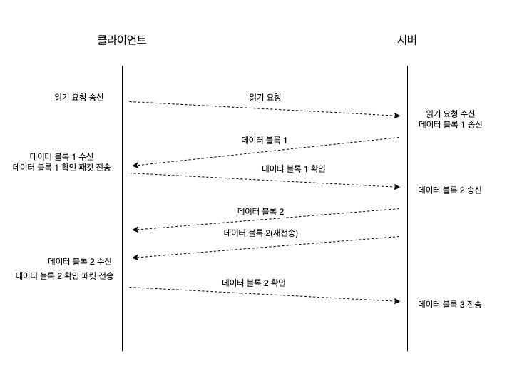

## UDP 통신의 신뢰성 확보

- TFTP (Trivial File Transfer Protocol) : UDP 로 신뢰성 있는 데이터 전송을 가능하게 하는 애플리케이션 프로토콜
- TFTP 는 UDP 상에서 TCP 기능 중 신뢰성에 대한 일부 기능을 구현하여 사용한 사례
  - 순차적 패킷 전송, 패킷 전송 확인 및 재전송
- TFTP 서버는 안전한 파일 전송에 적합하지 않습니다. 위의 신뢰성 기능을 구현하였지만, 패킷 자체의 암호화나 인증은 다루지 않았기 때문입니다.

### TFTP 동작방식

- 클라이언트로부터 읽기 요청 수락
- 데이터 패킷 전송
- 에러 패킷을 송신
- 클라이언트로부터 확인 패킷 수신

 

### TFTP 패킷 구조

            2 bytes     string    1 byte     string   1 byte
            ------------------------------------------------
           | Opcode |  Filename  |   0  |    Mode    |   0  |
            ------------------------------------------------

                       Figure 5-1: RRQ/WRQ packet

 

| 필드명   | 크기              | 설명                                        |
|----------|-------------------|---------------------------------------------|
| **Opcode**  | 2 bytes           | 요청 유형을 지정 (RRQ = 1, WRQ = 2)      |
| **Filename**| 가변 길이 (string) | 요청하는 파일 이름                        |
| **0 (NULL)**| 1 byte             | Filename 끝을 나타내는 NULL(0)            |
| **Mode**    | 가변 길이 (string) | 데이터 전송 모드 (netascii, octet, mail) |
| **0 (NULL)**| 1 byte             | Mode 끝을 나타내는 NULL(0)                |

- Opcode : 요청이 파일을 읽기(RRQ) 인지, 쓰기(WRQ) 인지 결정합니다.
- Filename : 전송하고자하는 파일의 이름을 지정합니다.
- Mode : 파일 전송 방식 (ASCII, 바이너리 등)을 지정합니다.

### 데이터 패킷

- 위와 같이 읽기 요청에 대한 패킷을 보냈으면 클라이언트는 데이터 패킷을 수신합니다.
- 데이터 패킷을 수신하는데 성공했다면 서버가 요청한 파일을 읽는 작업을 성공했다는 것을 의미합니다.

                   2 bytes     2 bytes      n bytes
                   ----------------------------------
                  | Opcode |   Block #  |   Data     |
                   ----------------------------------

                        Figure 5-2: DATA packet

| 필드명     | 크기            | 설명                                |
|------------|-----------------|-------------------------------------|
| **Opcode** | 2 bytes         | 패킷 유형을 지정 (DATA = 3)        |
| **Block #**| 2 bytes         | 데이터 블록 번호 (1부터 시작)      |
| **Data**   | n bytes         | 전송되는 실제 데이터 (파일 내용)    |

- Opcode 는 데이터 패킷임을 나타내며 값은 3입니다.
- Block 은 데이터 블록 번호로 1부터 시작하며 점차 증가합니다.
- Data 는 실제 파일의 데이터 부분으로 요청된 파일의 내용을 포함합니다.
- 이 패킷은 파일의 각 블록을 전송하는데 사용되며, TFTP 서버와 클라이언트 간의 파일 전송을 지원합니다.

 

### 데이터 전송 흐름도

- 클라이언트의 초기 읽기 요청 패킷을 읽고 난 후 서버는 첫 번째 데이터 블록으로 응답합니다.
- 클라이언트는 데이터블록 1에 대한 확인 패킷을 전송합니다.
- 서버는 데이터블록 2를 전송합니다.
- 클라이언트는 데이터블록 2를 수신했다는 확인 패킷을 전송합니다.

