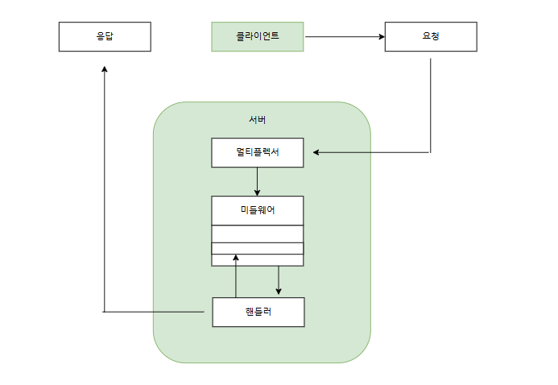

# HTTP 서비스 작성



- 서버의 멀티플렉서(multiplexer : 라우터)는 클라이언트의 요청을 수신
- 핸들러 : 멀티플렉서는 요청의 목적지를 결정한 후 해당 요청을 처리할 수 있는 능력이 있는 객체로 클라이언트의 요청을 전달
- 미들웨어 (middleware) : 핸들러의 동작을 변경하거나 로깅, 인증 및 접근 제어 등의 부가적인 작업 수행

<br />

### 서버의 다양한 타임아웃 값

```
srv := &http.Server{
    Addr:              addr,
    Handler:           mux,
    IdleTimeout:       time.Minute,
    ReadHeaderTimeout: 30 * time.Second,
}
```

- IdleTimeout : 통신이 keepalive 를 사용할 때 다음 클라이언트 요청을 기다리는 동안 서버 사이드의 TCP 소켓을 열어두는 시간을 정함
- ReadHeaderTimeout : 서버가 요청 헤더를 읽는 동안 기다리는 시간을 지정

위의 두 필드가 지정하는 대기 시간은 실제로 요청 Body 를 읽는데 걸리는 시간과는 무관함
- keep-alive : 클라이언트와 서버 간의 TCP 연결을 일정 시간 유지해서 여러 요청을 같은 연결에서 반복적으로 처리할 수 있게 하는 기능


---

### TLS 지원하기

- 기존 HTTP 트래픽은 plaintext 이지만, 암호화된 TLS 연결을 이용하여 HTTPS 를 사용할 수 있음

```shell
var err error
if cert != "" && pkey != "" {
  log.Println("TLS enabled")
  err = srv.ListenAndServeTLS(cert, pkey)
} else {
  err = srv.ListenAndServe()
}
```

- ListenAndServeTLS(cert, pkey) 를 사용하여 golang 만으로 HTTPS 를 지원할 수 있음
- 포트는 443, 8443 과 같이 443을 포함해서 사용함

<br />

### 핸들러

- Go 에서 핸들러는 http.Handler 인터페이스를 구현한 객체
- 서버는 먼저 응답 상태 코드를 작성한 후 응답 Body 를 작성한다.
- 응답상태 코드가 설정되면 이미 클라이언트에게 상태코드를 전송했을 수 있기 때문에 변경할 수 없다.
- 핸들러에서 사용할 객체들을 주입하기 위해 클로저(closure)를 사용한다.

```shell
type Handlers struct {
  db *sql.DB
  log *log.Logger
}
```

<br />

### 미들웨어

- 미들웨어는 http.Handler 를 매개변수로 받아서 http.Handler 를 반환하는 재사용할 수 있는 함수로 구성
- 미들웨어는 각각 최소한의 한가지 기능만을 수행해야 한다.
  - 각 요청 메서드를 확인하여 클라이언트에게 응답하는 미들웨어, 인증 미들웨어, 응답 헤더 미들웨어, 메트릭스 수집 미들웨어
- net/http 패키지에는 정적 파일 서빙, 요청 리다이렉트, 타임아웃 관리 등 유용한 미들웨어 존재

<br />

### 멀티플렉서

- 클라이언트의 요청을 특정한 핸들러로 라우팅해주는 범용 핸들러


<br />

## HTTP2/ 서버 푸시

- 캐시에 해당하는 리소스의 경우 push 하는 것은 비효율적임, 따라서 서버 푸시는 보수적으로 처리되는 것이 좋음